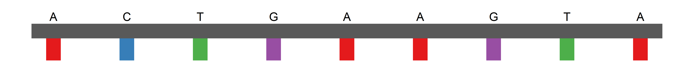
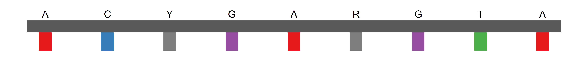

<!-- README.md is generated from README.Rmd. Please edit that file -->

# DNAplot

<!-- badges: start -->

[](https://github.com/brunomioto/DNAplot/actions/workflows/R-CMD-check.yaml)
<!-- badges: end -->

The DNAplot package provides a simple and customizable function to
create aesthetically pleasing plots of DNA sequences. Each base is
represented by a colored rectangle, allowing for easy visualization and
analysis of sequence features.

## Installation

You can install the development version of DNAplot from
[GitHub](https://github.com/) with:

``` r
# install.packages("remotes")
remotes::install_github("brunomioto/DNAplot")
```

## Get started

``` r
library(DNAplot)
```

Just write a sequence and plot it!

``` r
sequence <- "ACTGAAGTA"

plot_dna(sequence)
#> ℹ Plotting 9 bases
```



You can also plot undefined bases

``` r
sequence <- "ACYGARGTA"

plot_dna(sequence)
#> ℹ Plotting 9 bases
```


